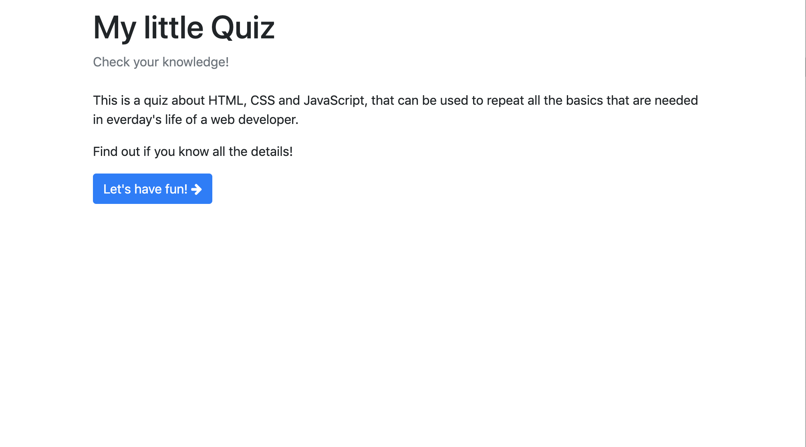
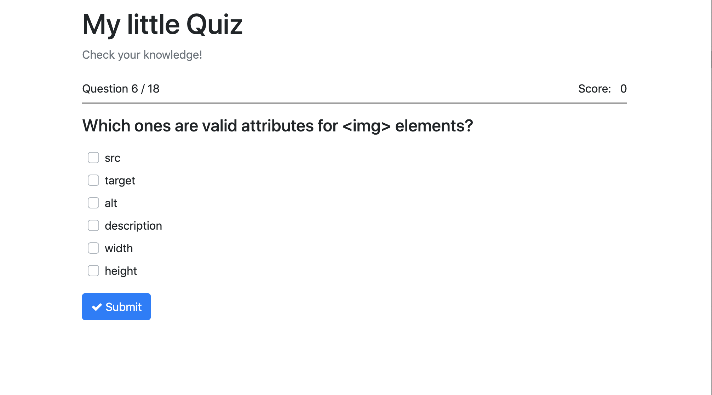
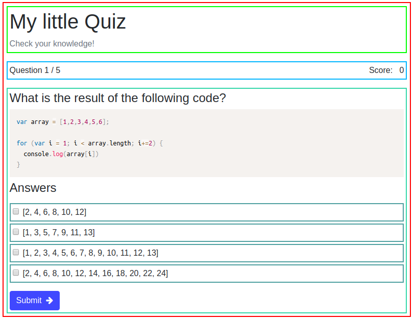

## Instructions for students:

### Create a Quiz

Create a quiz with React, You should create a file with questions and answers for the quiz (refer to Questions/answers for the Quiz in this file). Once the user marks the answer and clicks submit, they should be able to see the correct answer highlighted in green and the wrong answer highlighted in red, then the user will click next question until the end of the quiz, if the user does not click any answer remind them to select one. Update the score after every answer and display it at all times. The quiz result should display the answered questions, the correct answers, the wrong answers and the option to restart the quiz.

-   Start the project with create react app.

-   Your quiz should contain the following components: App, Home, Error404, StatusBar, Question, Answer, Result.

-   Use Lifecycle methods.

-   Use React Router.

-   See images for reference:
    
    
    

**Bonuses**

-   Make your own questions and answers
-   Increase the amount of questions.

### Rules

-   This is an individual assignment.
-   Deadline: 2 days.
-   Use **Git properly**
-   Feel free to document your code with comments.

### Questions/answers for the Quiz

```javascript

{
  "720ec11d-1056-484d-8a1c-fd2580019ea3": {
    uuid: "720ec11d-1056-484d-8a1c-fd2580019ea3",
    question: "What does HTML stand for?",
    answers: [
      { text: "Http Transfer Modeling Language" },
      { text: "Hyper Text Markup Language" },
      { text: "Holistic Text Markup Language" }
    ],
    solutions: [1]
  },
  "f6a5f270-748f-47d5-9343-adac85c3d993": {
    uuid: "f6a5f270-748f-47d5-9343-adac85c3d993",
    question: "Which ones are valid HTML document type definitions?",
    answers: [
      { text: "<!doctype html-5>" },
      { text: "<!doctype html5>" },
      { text: "<!doctype html>" }
    ],
    language: "html",
    solutions: [2]
  },
  "6490b8ab-f5c1-4019-86f2-b6cdd3d7c6ba": {
    uuid: "6490b8ab-f5c1-4019-86f2-b6cdd3d7c6ba",
    question: "Which ones are valid HTML elements?",
    answers: [
      { text: "<head>" },
      { text: "<header>" },
      { text: "<body>" },
      { text: "<row>" },
      { text: "<foot>" },
      { text: "<footer>" }
    ],
    solutions: [1, 2, 5],
    language: "html"
  },
  "d0bca746-f7e8-430f-827f-165b83758177": {
    uuid: "d0bca746-f7e8-430f-827f-165b83758177",
    question: "Which ones are valid link definitions?",
    answers: [
      { text: '<a src="http://www.google.de">' },
      { text: '<a target="http://www.google.de" ref="_blank">' },
      { text: '<a href="http://www.google.de" target="_blank">' },
      { text: '<a href="email:john.doe@mail.com">' },
      { text: '<a href="mailto:john.doe@mail.com">' }
    ],
    solutions: [2, 4],
    language: "html"
  },
  "a56abb5d-612d-4105-9505-6db7e8f1d23c": {
    uuid: "a56abb5d-612d-4105-9505-6db7e8f1d23c",
    question: "Which ones are valid image definitions?",
    answers: [
      {
        text:
          ''
      },
      { text: '' },
      { text: '' },
      {
        text:
          ''
      },
      {
        text:
          '<image src="horse.jpg" width="250" height="250" alt="My little pony">'
      }
    ],
    solutions: [0, 3],
    language: "html"
  },
  "7a65931c-8d52-4e4c-a7e3-295c94da8a69": {
    uuid: "7a65931c-8d52-4e4c-a7e3-295c94da8a69",
    question: "Which ones are valid attributes for  elements?",
    answers: [
      { text: "src" },
      { text: "target" },
      { text: "alt" },
      { text: "description" },
      { text: "width" },
      { text: "height" }
    ],
    solutions: [0, 2, 4, 5]
  },
  "23eedcfe-ed96-4a1c-b263-8dcc0184c882": {
    uuid: "23eedcfe-ed96-4a1c-b263-8dcc0184c882",
    question: "Which statements about the following code are correct?",
    code:
      '<div class="container">\r\n\t<div class="row" width="50%">\r\n\t\t<div class="col-lg-6">\r\n\t\t\tFirst column\r\n\t\t</div>\r\n\t\t<div class="col-lg-6">\r\n\t\t\tSecond column\r\n\t\t<div>\r\n\t</div>\r\n</div>',
    language: "html",
    answers: [
      { text: "There are too many columns." },
      { text: "There is a wrong code highlighting." },
      { text: "There are elements without a closing tag." },
      { text: "There are wrong attributes used." }
    ],
    solutions: [2, 3]
  },
  "e8f018b6-d8a0-4b83-9a45-fd5106019c19": {
    uuid: "e8f018b6-d8a0-4b83-9a45-fd5106019c19",
    question: "Which ones are valid stylesheet definitions?",
    answers: [
      { text: '<style src="style.css"></style>' },
      { text: '<stylesheet src="style.css"></stylesheet>' },
      { text: '<link rel="stylesheet" type="text/css" />' },
      { text: '<link rel="stylesheet" />' },
      {
        text: "<style type=”text/css”>.my-class { font-weight: bold; }</style>"
      }
    ],
    solutions: [2, 4],
    language: "html"
  },
  "e5e695e4-d02b-4577-851a-9d6a1b75ba14": {
    uuid: "e5e695e4-d02b-4577-851a-9d6a1b75ba14",
    question: "Which ones are valid color definitions?",
    answers: [
      { text: "#ff00" },
      { text: "#ccc" },
      { text: "#a065fb" },
      { text: "rgba(0, 0, 0)" },
      { text: "rgb(0, 0, 0)" },
      { text: "rgba(0, 0, 0, 0.5)" }
    ],
    solutions: [1, 2, 4, 5]
  },
  "4052fbca-8b1b-486e-807d-a413552d8deb": {
    uuid: "4052fbca-8b1b-486e-807d-a413552d8deb",
    question: "Which ones are valid value for the display property?",
    answers: [
      { text: "block" },
      { text: "blocks" },
      { text: "inline-block" },
      { text: "none" },
      { text: "hidden" },
      { text: "flex" }
    ],
    solutions: [0, 2, 3, 5]
  },
  "4bed0ba0-c25b-4911-8f3c-d2634ee0775d": {
    uuid: "4bed0ba0-c25b-4911-8f3c-d2634ee0775d",
    question: "Which statemens about margin and padding are valid?",
    answers: [
      {
        text: "Padding is used to provide spacing directly within an element."
      },
      {
        text:
          "Margin allows us to set the amount of space that surrounds an element."
      },
      {
        text:
          "Padding allows us to set the amount of space that surrounds an element."
      },
      { text: "Margin is used to provide spacing directly within an element." },
      { text: "Padding can have a negative value." },
      { text: "Margin can have a negative value." }
    ],
    solutions: [0, 1, 5]
  },
  "6c958b4e-2e21-48e3-b302-7356b4093856": {
    uuid: "6c958b4e-2e21-48e3-b302-7356b4093856",
    question: "Which one is the default value of the box-sizing property?",
    answers: [
      { text: "border-box" },
      { text: "content-box" },
      { text: "flexbox" },
      { text: "grid" }
    ],
    solutions: [1]
  },
  "3a3d27d2-3b50-4a6a-a8e4-5ff727e419e8": {
    uuid: "3a3d27d2-3b50-4a6a-a8e4-5ff727e419e8",
    question: "Which statemens about the position property are valid?",
    answers: [
      {
        text: "Relative elements cannot change their position."
      },
      {
        text: "Relative elements always have to be inside an absolute element."
      },
      {
        text: "Absolute elements always have to be inside a relative element."
      },
      {
        text: "Absolute elements are based on the next relative parent element."
      },
      { text: "Absolute elements are based on the body element." }
    ],
    solutions: [2, 3]
  },
  "3a21a1af-1530-485c-90bd-fbc81a4da76a": {
    uuid: "3a21a1af-1530-485c-90bd-fbc81a4da76a",
    question: "Which are valid CSS properties used for typography?",
    answers: [
      {
        text: "font-family: Verdana,Arial,sans-serif;"
      },
      {
        text: "font-decoration: underline;"
      },
      {
        text: "font-size: 1rem;"
      },
      {
        text: "font-weight: 700;"
      },
      { text: "line-numbers: true;" },
      { text: "text-decoration: underline;" },
      { text: "text-color: blue;" }
    ],
    solutions: [0, 2, 3, 5],
    language: "css"
  },
  "db06a0d7-77af-491a-a244-17cdcdfa0c63": {
    uuid: "db06a0d7-77af-491a-a244-17cdcdfa0c63",
    question: "Which ones are valid values for the font-weight property?",
    answers: [
      { text: "font-weight: -100;" },
      { text: "font-weight: 400;" },
      { text: "font-weight: 700;" },
      { text: "font-weight: 1200;" }
    ],
    solutions: [1, 2, 3]
  },
  "824ec22a-1056-484d-8a1c-fd2580019ea3": {
    uuid: "824ec22a-1056-484d-8a1c-fd2580019ea3",
    question: "What is the result of the following code?",
    code:
      "var array = [1,2,3,4,5,6];\r\n\r\nfor (var i = 1; i < array.length; i+=2) {\r\n  console.log(array[i])\r\n}",
    language: "javascript",
    answers: [
      { text: "[2, 4, 6, 8, 10, 12]" },
      { text: "[1, 3, 5, 7, 9, 11, 13]" },
      { text: "[1, 2, 3, 4, 5, 6, 7, 8, 9, 10, 11, 12, 13]" },
      { text: "[2, 4, 6, 8, 10, 12, 14, 16, 18, 20, 22, 24]" }
    ],
    solutions: [0]
  },
  "jfads8-1056-484d-8a1c-fd2580019ea3": {
    uuid: "jfads8-1056-484d-8a1c-fd2580019ea3",
    question: "What is the result of the following code?",
    code: 'const result = 1 + Number("2") + "3";',
    language: "javascript",
    answers: [{ text: "13" }, { text: "18" }, { text: "22" }],
    solutions: [0]
  },
  "913db727-61c5-4968-b244-fb015a1f0e74": {
    uuid: "913db727-61c5-4968-b244-fb015a1f0e74",
    question: "What is the answer to life, the universe and everything?",
    answers: [
      { text: "7" },
      { text: "21" },
      { text: "144" },
      { text: "42" },
      { text: "0" }
    ],
    solutions: [3]
  }
};
```
