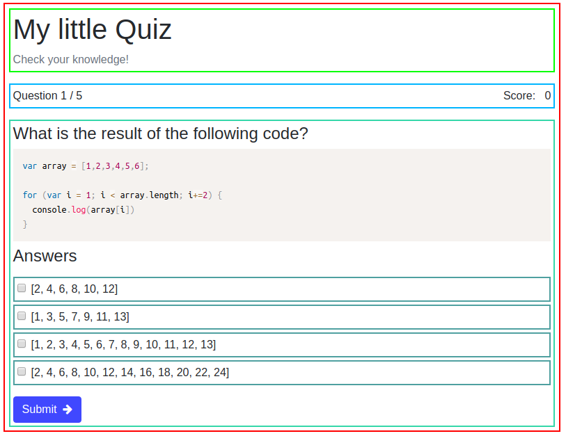

# React Quiz

## What it is

This is a small quiz build with React that shows some of the basic features of React like components, props and state, in combination with lifecycle methods.

## The component schema

